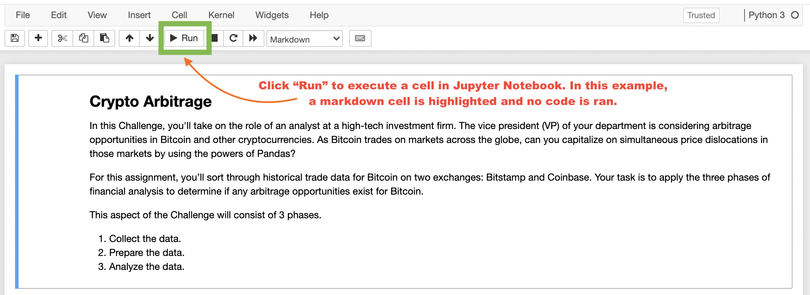
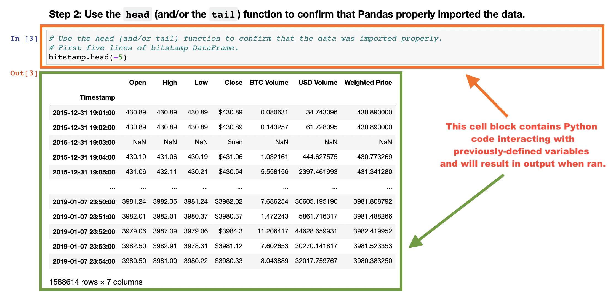

# Arbitrage Assessment of Bitcoin: Bitstamp vs. Coinbase 


---

## Technologies

Before attempting to execute any _Python_ code in `crypto_arbitrage.ipynb`, it is imperative that your development environment has the `pandas` and `matplotlib` modules installed. 

[pandas](https://pandas.pydata.org/pandas-docs/stable/) - Data analysis module.

[matplotlib](https://matplotlib.org/) - Data visualization module.

---

## Installation Guide

With your _Python 3.7+_ environment, run the following commands via CLI:

```
pip install pandas
pip install matplotlib
```

---

## Examples





---

## Usage

1. Clone repository onto your personal machine. 

2. Open _Jupyter Lab_ or _Jupyter Notebook_ via _Anaconda Navigator_ and navigate to the directory in which the file `crypto_arbitrage.ipynb` is present. _All relevant code for this repository will be executed via Jupyter Notebook and no output will be printed to the command line_. Ensure that all relevant dependencies and _Python_ modules are installed (see __Technologies__ and __Installation Guide__ for more details) before attempting to execute code within _Jupyter Notebook_; otherwise, you will receive multiple interpreter errors! 

3. With the notebook open, start at the very first cell reading "__Crypto Arbitrage__" (a cell will be active when a rectangular border is surrounding the area in question). Run each cell in sequential order. _It is vital that all cells are ran in sequential order or your notebook will generate compiler errors_!. 

---

## Contributors

New development created by Aaron C. Montano. **Code from 'Uploaded Starter Files' commit originates from UC Berkeley Extension and I do not claim original ownership nor scholarship**.

---

## License

Software tool available for public use. 
